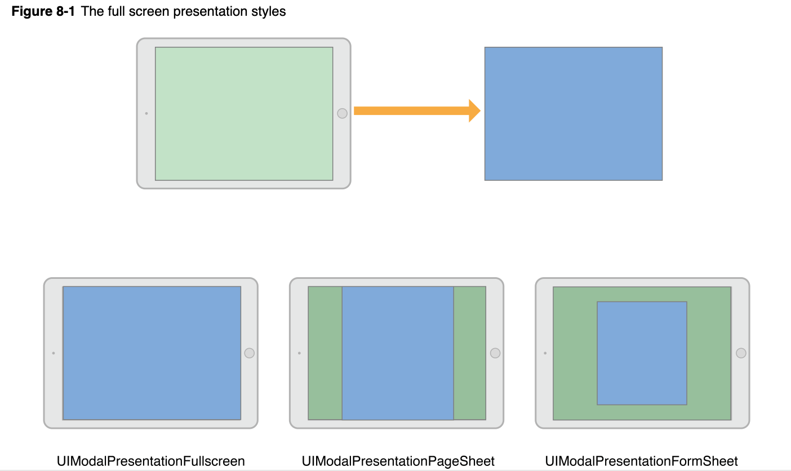
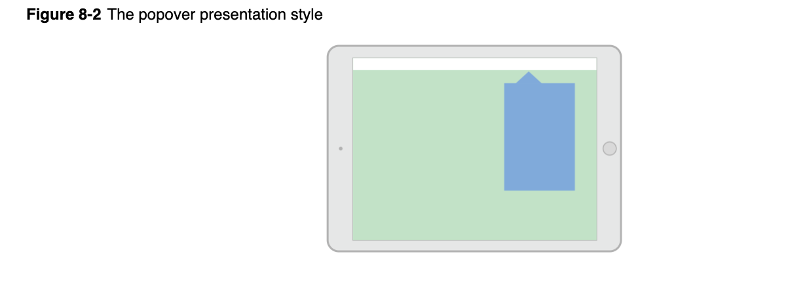
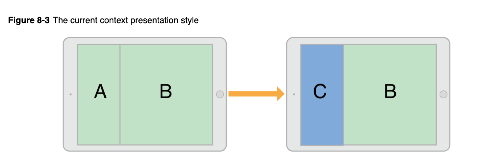
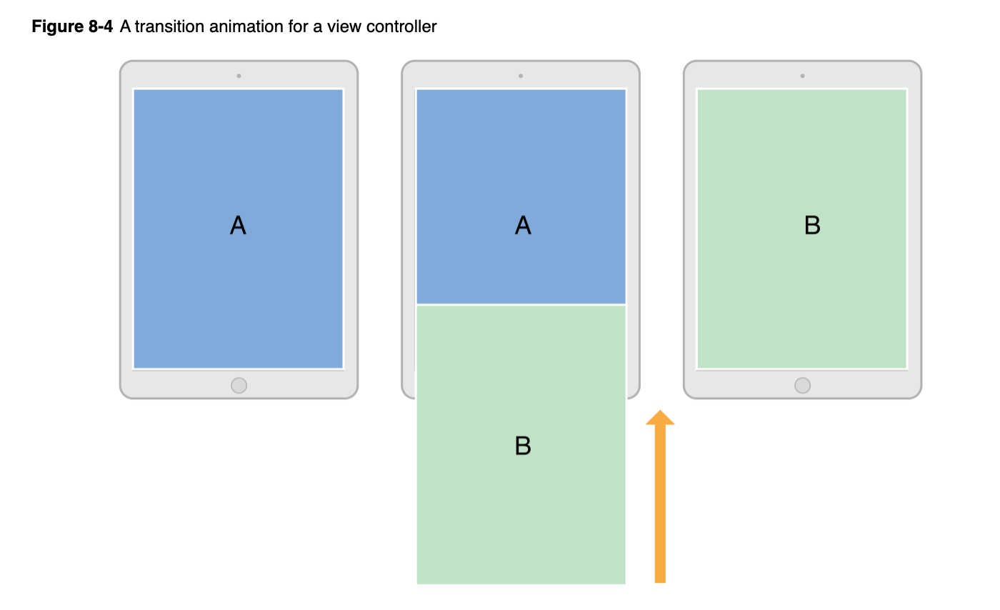
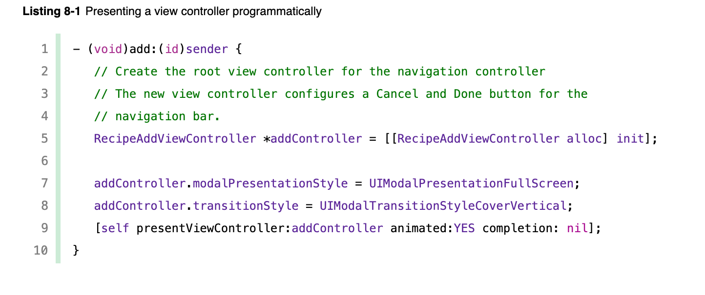
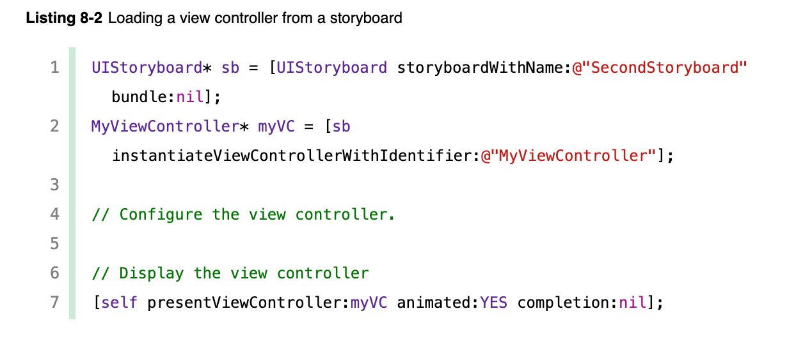

# Presenting a View Controller

##### 有两种方法将一个视图控制器展示在屏幕上：

+ 嵌入这个视图控制器到一个容器视图控制器(例如NavigationController)
+ Present 这个视图控制器

<容器视图控制器具有最基本的视图控制器导航功能，但是present也是一个导航视图控制器的有力工具>

1.可直接使用present方法去展示一个新的视图控制器在当前视图层次 的顶层

2.支持present要满足两个条件第一必须是依靠UIVIewController建立，第二必须是一个可识别的VIewController对象

3.你可以在任何一个视图控制器中present新的视图控制器，虽然UIKit可能路由这个请求到一个不同的视图控制器；

4.给present的原始视图控制器和present的新视图控制器添加联系；此联系成为视图控制器层次结构的一部分并保持着，知道dismiss这个新的视图控制器；

# 一.presentation and transition process

present一个视图控制器是一种将新内容动画到屏幕上的快速简便的方法；UIKit内置的present机制是你可以使用内置或自定义的动画显示新的视图控制器；内置的present和动画不需要很多的代码，因为UIKit可以处理所有的工作；自己可以自动以present和动画，并将其与任何视图控制器一起使用；

你可以使用编程的方式启动present视图控制器或者使用Segues,如果你在设计时知道app的导航(NavigationController),Segues是最容易的方法去初始化这个presentations;对于更多的动态界面或没有专用控件启动Segues的情况，可使用UIViewController的方法去present自己的视图控制器；

## Presentation Styles

#### (present 一个视图控制器的过程样式<并非视图控制器的样式>)

视图控制器presentation的样式决定其在屏幕的外观。UIkit定义的许多的presentation 的styles，每一个style都有特定的外观和目的；你也可以自定义presentation Styles;当设计app时，请选择最适合您要尝试的presentation styles，并将适当的常量分配给要呈现的视图控制器的**modalPresentationStyle**属性。

## Full-Screen Presentation Styles

Full screen presentation styles涵盖整个屏幕，从而防止与基础内容(present的视图底下那层的内容)的交互。在水平规则的环境中，只有一种全屏样式可以完全覆盖基础内容。其余部分合并了变暗视图或透明度，以允许基础视图控制器的某些部分通过，在水平紧凑的环境中， full-screen presentations 自动适应UIModalPresentationFullScreen样式，并覆盖所有基础内容

图8-1:声明这个presentation在水平规则环境中外观使用 `UIModalPresentationFullScreen`, `UIModalPresentationPageSheet`, and `UIModalPresentationFormSheet` styles；

在下图绿色视图控制器显示蓝色视图控制器，每种显示样式的结果如下所示：在有些presentation styles,UIkit 在两个视图控制器之间插入一个调光视图(dimming view)；

Note:

当使用UIModalPresentationFullScreen样式present视图控制器时，UIKit通常会在过渡动画完成后删除基础视图控制器的视图;您可以通过指定UIModalPresentationOverFullScreen样式来防止删除这些视图。当显示的视图控制器具有透明区域以使基础内容显示出来时，可以使用该样式;

当使用full-screen presentation styles,启用presentation的这个视图控制器它自己本身要覆盖整个屏幕；如果presenting 这个视图控制器没有覆盖整个屏幕，UIKit沿视图控制器层次机构前进，直到找到一个覆盖全屏的VC,如果找不到能填满整个屏幕的中间视图控制器，则UIKit将使用窗口的根视图控制器。

## The Popover Style

这个 `UIModalPresentationPopover` style 在弹出视图(Popover)中显示视图控制器；弹出窗口对于显示其他信息或与聚焦或选定对象有关的项目列表很有用。在下面这个水平环境中，这个popover view仅仅是覆盖了这个屏幕的一部分如下图8-2；

在水平紧凑的环境中，默认情况下，弹出框适UIModalPresentationOverFullScreen presentation styles。弹出视图外部的轻击会自动关闭弹出窗口。

由于弹出框适用于水平紧凑的环境中的full-screen presentations，您通常需要修改您的弹出代码来处理这种适应。在全屏模式，你需要一个方法去**dismiss**一个presented popover;你可以通过添加按钮，将弹出窗口嵌入dismissible container view Controller,或者改变其自身的适应行为；

## The Current Context Styles

这个 `UIModalPresentationCurrentContext` style在你的界面上覆盖指定的视图控制器;当使用contextual style,可以通过将其**definesPresentationContext**属性设置为YES;图8-3声明一个当前context presentation 仅仅覆盖分视图(孩子视图)中的一个；

Note:

当presenting 一个视图控制器使用 `UIModalPresentationFullScreen` style,UIKit通常在过渡动画结束后删除基础视图控制器的视图。您可以通过指定UIModalPresentationOverCurrentContext样式来防止删除这些视图。当显示的视图控制器具有透明区域以使基础内容通过显示时，您可以使用该样式；

视图控制器可以定义presentation context 还可以定义这个presentation 视图控制器的过渡(transition)动画；一般,UIkit使用present的视图控制器的**modalTransitionStyle**属性中的值在屏幕上对视图控制器进行动画处理；如果将presentation context的视图控制器的`providesPresentationContextTransitionStyle` set to `YES`,UIKit改用该视图控制器的modalTransitionStyle属性中的值。

当过渡到水平紧凑的环境时，当前context styles 适应`UIModalPresentationFullScreen` style；若要改变该行为，使用自适应presentation delegate 去指定一个不同的presentation style或者其他视图控制器；

### Custom Presentation Styles

UIModalPresentationCustom  style使您可以使用定义的自定义样式来呈现视图控制器;创建一个自定义样式以及继承UIPresentationController,并使用其方法在屏幕上创建任何自定义视图的动画，并设置显示的视图控制器的大小和位置。这个presentation Controller 也可以处理一些由于presented view Controller的特征更改而发生的任何改编；

### Transition Styles

Transition styles决定presented VC的动画(animations)的类型；您可以将标准transition styles 之一分配给你想要present的视图控制器的**modalTransitionStyle**属性。当你present这个视图控制器时，UIKit创造与style相对应的动画；例如图8-4声明在这个视图控制器屏幕上的标准的上划动画(animates)(`UIModalTransitionStyleCoverVertical`) 视图控制器B开始在屏幕外启动，并在视图控制器A的上方进行动画处理。关闭视图控制器B时，动画会反转，以便B向下滑动以显示A。

你可以创建自定义的transitions 使用一个animator object 和transitioning delegate.这transitioning delegate 支持transitions ；see [Customizing the Transition Animations](https://developer.apple.com/library/archive/featuredarticles/ViewControllerPGforiPhoneOS/CustomizingtheTransitionAnimations.html#//apple_ref/doc/uid/TP40007457-CH16-SW1).

### Presenting Versus Showing a View Controller

 `UIViewController`类提供两个方法去展示一个视图控制器；

+  `showViewController:sender:`和[showDetailViewController:sender:](https://developer.apple.com/documentation/uikit/uiviewcontroller/1621432-showdetailviewcontroller)

  提供提供最适合和灵活的方法去展示视图控制器；这些方法让presenting view controller 决定怎样最好的去处理这个presentation;例如，容器视图控制器可以将视图控制器作为子级合并，而不是模态地present;默认行为以模态形式present视图控制器。

+ 这[presentViewController:animated:completion:](https://developer.apple.com/documentation/uikit/uiviewcontroller/1621380-presentviewcontroller)方法总是以modally的形式展示这个视图控制器；调用此方法的视图控制器最终不会处理presentation,但是这个presentation始终是modal态的；

  

  这**showViewController:sender:**` and `**showDetailViewController:sender:**方法是初始化presentations的首选方法；视图控制器可以调用它们，而无需了解其余视图控制器层次结构或当前视图控制器在该层次结构中的位置。视图控制器可以调用它们，而无需了解其余视图控制器层次结构或当前视图控制器在该层次结构中的位置。

  

### Presenting a View Controller

这有几种初始化视图控制器的presentation的初始化的方法;

1.使用Segue自动的去present这个视图控制器；这个Segue使用你在Interface Builder中指定的信息实例化并显示视图控制器；详情请查看[Using Segues](https://developer.apple.com/library/archive/featuredarticles/ViewControllerPGforiPhoneOS/UsingSegues.html#//apple_ref/doc/uid/TP40007457-CH15-SW1).

2.使用 `showViewController:sender:` or `showDetailViewController:sender:`这些方法去展示视图控制器；在自定义视图控制器中，您可以将这些方法的行为更改为更适合您的视图控制器的行为。

3.调用**presentViewController：animated：completion：**方法以模态显示视图控制器。

+ #### Showing View Controllers

  当使用 `showViewController:sender:` 和 showDetailViewController:sender:方法，在屏幕上获取新视图控制器的过程非常简单：

  1.创建你想要present的视图控制器；当创建这个视图控制器时，您有责任使用执行任务所需的任何数据对其进行初始化

  2.将新的视图控制器的 `modalPresentationStyle`属性设置为首选表示样式。在最终演示中可能不会使用此样式。

  3.将视图控制器的modalTransitionStyle属性设置为所需的过渡动画样式。此样式可能不会在最终动画中使用。

  4.调用当前视图控制器的showViewController：sender：和showDetailViewController：sender：方法。

  UIKit将对showViewController：sender：和showDetailViewController：sender：方法的调用转发给相应的presented视图控制器。然后，该视图控制器可以决定如何最好地执行presentation，并可以根据需要更改演示和过渡样式。例如，导航控制器可能会将视图控制器推入其导航堆栈(navigation stack)中。

+ #### Presenting View Controllers Modally

  直接presenting视图控制器时，您告诉UIKit您希望新视图控制器如何显示以及如何在屏幕上对其进行动画处理。

  1.创建你想要present这个新的视图控制器对象;当创建这个视图控制器时，您有责任使用执行任务所需的任何数据对其进行初始化

  2.将新的视图控制器的**modalPresentationStyle**属性设置为所需的演示样式。

  3.将视图控制器的**modalTransitionStyle**属性设置为所需的动画样式。

  4.调用当前视图控制器的**presentViewController：animated：completion：**方法。

  这个视图控制器调用 `presentViewController:animated:completion:` 方法的视图控制器可能不是实际执行Modal表示的视图控制器。这个presentation style决定如何presented这个视图控制器,包括呈现视图控制器所需的特性;例如：一个full-screen presentation 必须被一个full-screen 视图控制器初始化；如果这个当前的presenting view controller 是不适合的，UIkit遍历完视图控制器层次结构，知道找到一个合适的；Modal表示完成后，UIKit将更新受影响的视图控制器的presentingViewController和presentedViewController属性。

  清单8-1：展示怎样使用代码去present 一个视图控制器；当用户添加新食谱时，该应用会通过显示导航控制器来提示用户有关食谱的基本信息。选择了导航控制器，以便在标准位置放置“取消并完成”按钮。使用导航控制器还使将来扩展新配方界面变得更加容易。您要做的就是将新的视图控制器推入导航堆栈中。

  

+ #### Presenting a View Controller in a Popover

  Popovers在你present之前需要增加额外的配置;将Modal表示样式设置为UIModalPresentationPopover后，配置以下与Popover相关的属性：

  1.将您的视图控制器的**preferredContentSize**属性设置为所需的大小。

  2.使用关联的UIPopoverPresentationController对象设置popover锚点，该对象可从视图控制器的popoverPresentationController属性访问。仅设置以下一项

  + 将barButtonItem属性设置为条形按钮项。
  + 在其中一个视图中将sourceView和sourceRect属性设置为特定区域

  您可以根据需要使用UIPopoverPresentationController对象对弹出窗口的外观进行其他调整。popover演示控制器还支持一个委托对象，您可以使用该委托对象在演示过程中响应更改。例如，您可以使用委托在弹出窗口出现，消失或在屏幕上重新放置时做出响应。

## 二.Dismissing a Presented View Controller

去dismiss一个presented的视图控制器，调用这个presented VC的[dismissViewControllerAnimated:completion:](https://developer.apple.com/documentation/uikit/uiviewcontroller/1621505-dismissviewcontrolleranimated)方法；还可以在显示的视图控制器本身上调用该方法；当你在呈现的视图控制器上调用该方法时候;UIKIt会自动请求转发至presented 视图控制器；

总是在dismissing一个视图控制器之前保存一些重要的信息；Dismissing 一个视图控制器移除它从视图控制器层次结构中并且将它从屏幕中移除；如果你没有strong引用存储在其他位置的视图控制器，则将其关闭会释放与其关联的内存；‘

如果将presented视图控制器必须将数据返回到presented的视图控制器，请使用委托设计模式来促进传输；通过委派，可以更加轻松的在应用程序的不同部分重用视图控制器；通过委派，所提供的视图控制器存储对委托对象的引用，该对象实现了形式协议中的方法在收集结果时，呈现的视图控制器在其委托上调用这些方法。在典型的实现中，呈现视图控制器使自己成为其呈现视图控制器的委托。

## 三.Presenting a View Controller Defined in a Different Storyboard

虽然可以在同一storyboard中的视图控制器之间创建Segues，但是不能再不同的storyBoard中的视图控制器之间创建Segues;当你想要去展示一个存储在不同storyBoard中的视图控制器时，你必须在展示之前初始化这个视图控制器，如下8-2清单；这个例子以modal态present这个视图控制器，但是你可以将其推倒导航栏控制器上或者其他方式显示它。

没有必要创建多个storyBoard,以下列出几种情况下需要创建多个storyboard:

+ 您有一个庞大的编程团队，并且用户界面的不同部分分配给团队的不同部分。每个团队在不同的故事板文件中拥有部分用户界面，以最大程度地减少争用。
+ 您购买或创建了一个库，该库预定义了视图控制器类型的集合；这些视图控制器的内容在库提供的情节提要中定义。
+ 您需要在外部屏幕上显示内容。在这种情况下，您可以将与备用屏幕关联的所有视图控制器放在单独的故事板上。同一场景的另一种模式是编写自定义序列。